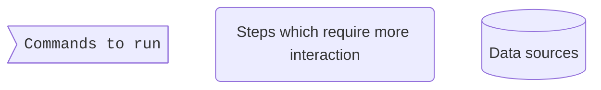
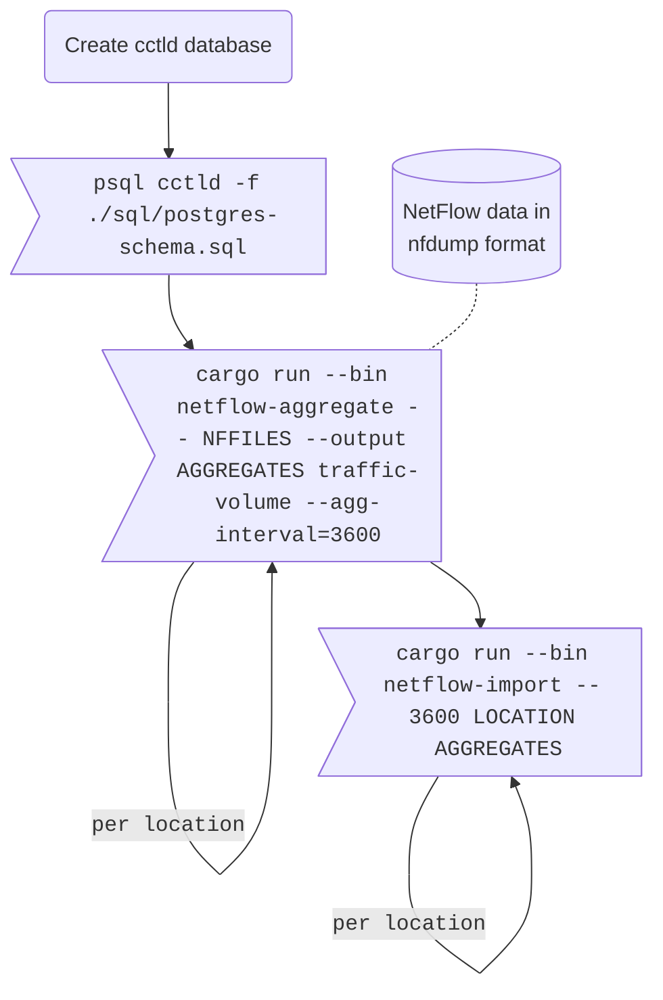
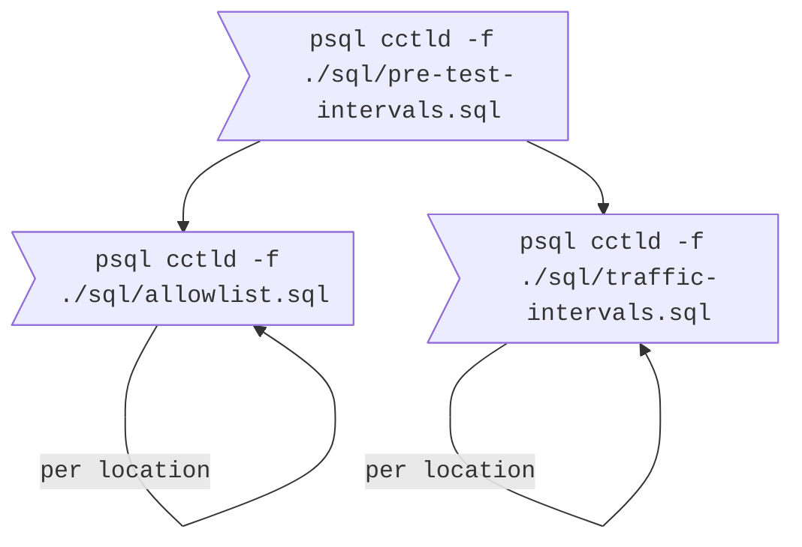

# Reputation Defense for Application-Layer DDoS Against DNS Authoritatives

This README accompanies the paper "Reputation Defense for Application-Layer DDoS Against DNS Authoritatives".
We publish the code to help reproducibility.
Unfortunately, we cannot disclose the raw data, due to the sensitive nature of DNS name lookups and the national data protection laws.

The code in the repository can load NetFlow data, aggregate it and store it into a database.
From this data we can compute our allowlists (Section 4.2).
Based on the allowlist and the original traffic data, we simulate the impact our proposed filtering has on the benign and malicious traffic.

1. [Required Software](#required-software)
2. [Importing Data and Processing It](#importing-data-and-processing-it)
    1. [Importing NetFlow data into Postgres](#importing-netflow-data-into-postgres)
    2. [Further Data Aggregation](#further-data-aggregation)
    3. [Filtering Algorithm Parameter Optimization](#filtering-algorithm-parameter-optimization)
    4. [Generating Plots](#generating-plots)

## Required Software

We used the following tools for the project.

* Jupyter Lab
    * Jupytext
* nfdump
* Rust (stable)
* Postgres 11+
* Python 3.10

## Importing Data and Processing It

In the following we describe how we imported and processed the data for the paper.
We will visualize the steps using simple flowcharts and use this convention for the steps.



### Importing NetFlow data into Postgres



First we need to set up a Postgres database.
We create a database called `cctld` and grant the current user all permissions on it.
The basis schema is provided in the `./sql/postgres-schema.sql` file.

Next we aggregate and import our set of nfdump NetFlow files.
We execute this step once per physical location.

All `cargo` commands should be executed with `--release` to achieve good performance.
We omit this flag from the flowcharts for brevity.

### Further Data Aggregation



Next we have a sequence of Postgres queries, which further aggregates the data into a usable format.
The `pre-test-intervals.sql` script creates temporary aggregates used in the next steps.
`allowlist.sql` computes the allowlist.
This step needs to be repeated once per location, but all locations can run in parallel.
`traffic-intervals.sql` computes the traffic occurring during different intervals.
This also needs to be repeated once per location.

### Filtering Algorithm Parameter Optimization

```mermaid
%%{init: { 'fontFamily': 'monospace' } }%%
flowchart TD
    classDef normal font-family:sans-serif;

    attackerips[(Attacker IPs<br>and strength)]:::normal
    catchment[(Full catchment<br>information)]:::normal

    grid>"cargo run --bin param-grid-search -- --attacker-ips ATTACKER_IPS --catchment CATCHMENT"]
    optimization>"cargo run --bin param-optimization -- --configuration CONFIGURATION EVAL_RESULTS"]
    evasion>"cargo run --bin param-grid-search -- --attacker-ips ATTACKER_IPS --catchment CATCHMENT --evasion-ips 1337"]
    evasioneval>"cargo run --bin param-evasion -- --configuration CONFIGURATION BASEDIR"]

    attackerips & catchment -.- grid & evasion

    grid --> optimization
    grid -. eval_results_*.json .- optimization
    optimization -. Best config .- evasion
    evasion --> evasioneval
    evasion -. eval_results_*.json .- evasioneval
```

With our populated database we can now search for optimal algorithm parameters.
The parameters are set in the [`param-grid-search.rs`](./crates/evaluation/src/bin/param-grid-search.rs) file as constants.
You can update these to suit your needs.
Simulating a filtering run requires an attacker model.
This is specified by an external file, which lists the IP address of the attacker and how much traffic in relation to each other they can send.
This allows modelling an attacker with multiple attacking nodes of different strengths.
Additionally, a file describing the catchment of each location is necessary.
This describes for each IP range and each anycast IP address to which location the traffic is routed.
Multiple locations can be provided.

The output of `param-grid-search` is then further processed by `param-optimization` which can run a global optimization pass or day-forward-chaining.

Recreating the evasion simulation is possible with `param-grid-search` by providing the `--evasion-ips` arguments, which specifies how many of the attacker IPs are counted as having evaded detection.
These results are then processed by `param-evasion`.

Please check the top of the files, and the help text of each program for more details.

### Generating Plots

The [`notebooks`](./notebooks/) folder contains the scripts we used to generate the plots for our paper.
The scripts consume the `eval_results_*.json` files generated in the step above.
If further sources are needed, that is explained in the files.
Each `*.py` file is a Jupyter notebook in the percent format.
Each cell is separated by `# %%`.
You can use jupytext to convert it back into a `*.ipynb` notebook.
